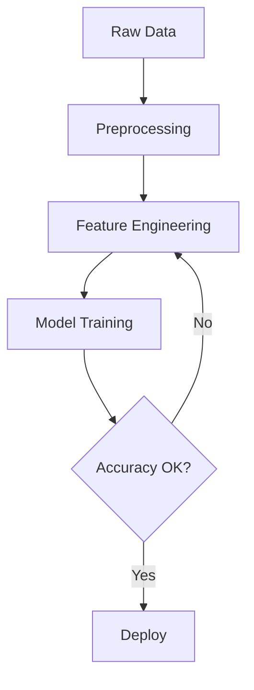
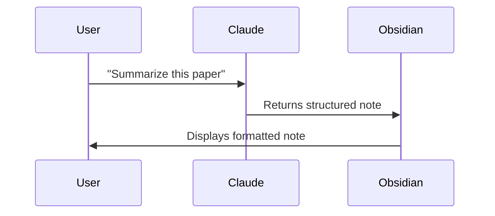
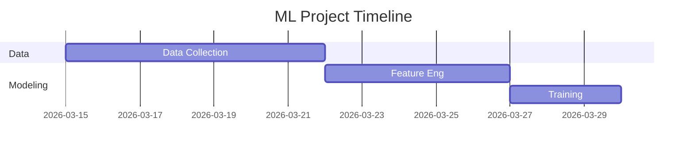

# Module 02 — Markdown Mastery

**Goal:** Master every markdown feature Obsidian supports — from basics to callouts, embeds, LaTeX, and Mermaid diagrams.

**Time:** 1-2 hours

---

## Why Markdown Mastery Matters

When you use Claude to generate notes, it outputs markdown. When you write prompts asking Claude to create content for Obsidian, you need to know what Obsidian can render so you can ask for exactly the right format.

---

## Standard Markdown

```markdown
# H1  ## H2  ### H3  #### H4

**bold**   *italic*   ~~strikethrough~~   ==highlight==   `inline code`

- Bullet list
  - Nested bullet
    - Deeper nest

1. Ordered list
2. Second item
   1. Nested ordered

> Blockquote
> Can span multiple lines

[Link text](https://url.com)
[[Internal wikilink]]
[[Note Name|Custom display text]]


![[Embed another note]]
![[Note#Section heading]]   ← embed just one section

---   ← horizontal rule
```

---

## Obsidian Callouts (very useful)

Callouts are highlighted boxes. Syntax: `> [!type]`

```markdown
> [!note]
> This is a note callout.

> [!tip] Custom Title
> Tips stand out visually.

> [!warning]
> Pay attention to this.

> [!danger]
> Do not do this.

> [!info]
> Informational content.

> [!example]
> Here's how it works...

> [!question]
> Still unclear? Ask Claude.

> [!success]
> This worked.

> [!quote]
> "A note that isn't linked is a note that doesn't exist." — unknown
```

Callouts can be **collapsible**:
```markdown
> [!note]- Collapsed by default (- means collapsed)
> Content hidden until clicked.

> [!note]+ Expanded by default
> Content shown by default.
```

---

## Code Blocks

````markdown
```python
def greet(name: str) -> str:
    return f"Hello, {name}!"
```

```sql
SELECT team, AVG(win_rate) as avg_win
FROM team_stats
GROUP BY team
ORDER BY avg_win DESC
LIMIT 10;
```

```bash
cd ~/Documents/MyBrain
git status
```
````

---

## Tables

```markdown
| Column A | Column B | Column C |
|----------|----------|----------|
| Data 1   | Data 2   | Data 3   |
| Data 4   | Data 5   | Data 6   |

# Alignment
| Left | Center | Right |
|:-----|:------:|------:|
| L    |   C    |     R |
```

---

## LaTeX (Math)

Enable in Settings → Editor → "LaTeX math rendering"

```markdown
Inline math: $E = mc^2$

Block math:
$$
\hat{y} = \sigma\left(\sum_{i} w_i x_i + b\right)
$$

Gradient descent:
$$
\theta := \theta - \alpha \nabla_\theta J(\theta)
$$
```

Great for data science notes — document your model equations.

---

## Mermaid Diagrams

Obsidian renders Mermaid natively. Great for SWE architecture notes.

````markdown





````

---

## Embeds

```markdown
# Embed full note
![[Python Decorators]]

# Embed a specific section
![[Python Decorators#Examples]]

# Embed with alias
![[Python Decorators|Decorators]]

# Embed image (from vault or URL)
![[screenshot.png]]

```

---

## Footnotes

```markdown
This claim needs a citation.[^1]

[^1]: Source: Research paper, 2024.
```

---

## Task Lists (Checkboxes)

```markdown
- [ ] Unchecked task
- [x] Completed task
- [/] In progress (renders with slash in some themes)
- [-] Cancelled (renders with strikethrough in some themes)
```

Tasks are queryable with the Dataview plugin (Module 07).

---

## Hands-On Exercises

Create a note `Resources/Markdown/Markdown Reference` and practice:

- [ ] Write a callout of each type (note, tip, warning, example)
- [ ] Write a collapsible callout
- [ ] Write a table with 3 columns
- [ ] Embed a code block in Python and SQL
- [ ] Write a LaTeX equation (inline and block)
- [ ] Draw a simple Mermaid flowchart
- [ ] Embed one note inside another with `![[Note Name]]`
- [ ] Add a footnote

---

## What's Next

[Module 03 — Linking Your Thinking](../03-linking-thinking/README.md): Wikilinks, backlinks, graph view — the core of Obsidian's power.
