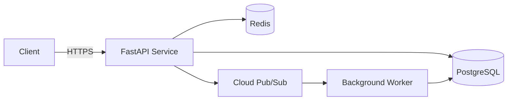

# Module 12 — Claude + Obsidian for Software Engineering

**Goal:** Build SWE workflows in Obsidian — architecture notes, ADRs, debugging journals, PR prep, onboarding docs, and codebase understanding.

**Time:** 3-4 hours

---

## The SWE Knowledge Problem

Software engineers have a different but equally painful knowledge problem:
- "Why did we make this decision?" → no record
- Debugging sessions: solved once, forgotten, solve again next month
- Onboarding: no written explanation of system design
- Architecture drift: code changed, docs never updated
- Context switching: back from vacation, no idea where you left off

Obsidian + Claude transforms institutional knowledge from "lives in someone's head" to "lives in the vault."

---

## Vault Structure for Software Engineering

```
MyBrain/
├── Projects/
│   ├── my-api-service/
│   │   ├── MOC.md
│   │   ├── Architecture/
│   │   ├── Decisions/          ← ADRs
│   │   ├── Debugging/
│   │   ├── PRs/                ← PR prep notes
│   │   └── Journal/
│   └── data-pipeline/
├── Resources/
│   ├── Languages/              ← Python, Go, SQL patterns
│   ├── Tools/                  ← Docker, Kubernetes, GCP refs
│   ├── Patterns/               ← design patterns, architecture patterns
│   └── Cheatsheets/
└── Daily Notes/
```

---

## Architecture Decision Records (ADRs)

An ADR captures a decision: what was decided, why, and what alternatives were rejected.
These are among the most valuable notes you can write.

Use the ADR Templater template from Module 06, or this Claude prompt:

```
I made an architectural decision for my project. Help me write an ADR:

Decision: We chose PostgreSQL over MongoDB for the user data store.

Context: The data has relationships (users → orders → items). We need ACID
transactions. The team knows SQL. We're on GCP (Cloud SQL available).

Alternatives considered: MongoDB (NoSQL flexibility, but we don't need it),
Redis (too limited), SQLite (not production-grade at scale).

Write an ADR note for Obsidian in this format:
- YAML frontmatter (date, status: Accepted, tags: [adr])
- Context section
- Decision section
- Consequences (positive AND negative)
- Alternatives Considered section
- Related Decisions → [[wikilinks]]
```

---

## Debugging Journal

When you solve a hard bug, document it. Future you (and your team) will thank you.

**Debugging note workflow:**
```
I spent 4 hours debugging this. Here's what happened:

Symptom: API returning 500 errors intermittently, no useful stack trace.
Investigation: Checked logs → noticed "connection pool exhausted" warnings.
Root cause: Database connection pool size was 5 (default); under load, connections
            weren't being released because of a missing `finally` block.
Fix: Added finally block to close connection; raised pool size to 20.

Write an Obsidian debugging note:
- Symptom (what I saw)
- Investigation steps (what I tried)
- Root cause (what was actually wrong)
- Fix (what I changed + code snippet)
- Lesson (what to watch for next time)
- Tags: [debugging, python, database]
```

---

## System Architecture Notes

For any service or system you work on:

```
Here's the architecture of [system name]:
[describe or paste architecture diagram / README]

Write an Obsidian architecture note:
- What it does (one sentence)
- Components diagram (as Mermaid)
- Data flow description
- Key design decisions → [[ADR wikilinks]]
- Failure modes and mitigations
- Operational notes (how to deploy, monitor, debug)
- Related systems → [[wikilinks]]
```

Example Mermaid in an architecture note:


---

## PR Prep Workflow

Before opening a PR, use Claude + your notes to write a great description:

```
I'm opening a PR for this change:
[paste git diff or describe the change]

I have these notes from my debugging journal:
[paste debugging note or context]

Write a PR description:
## Summary (2-3 bullets: what changed and why)
## Context (link to issue/ADR if relevant)
## Changes (technical details for reviewers)
## Testing (how I tested this)
## Notes for Reviewers (anything they should pay attention to)
```

---

## Code Understanding Notes

When you need to understand a complex piece of existing code:

```
Here's a function I'm trying to understand:
[paste code]

Write an Obsidian note that explains:
- What this function does (plain English)
- Step-by-step breakdown of the logic
- What the parameters mean
- What edge cases it handles (or doesn't)
- When/how it's called (I'll fill this in)
- Potential issues I should know about
```

---

## Onboarding Documentation

When a new team member joins or you switch to a new codebase:

```
I'm onboarding onto [project/codebase]. Here's what I've learned so far:
[paste notes]

Create an onboarding guide for my Obsidian vault:
- Project overview (what it does, who uses it)
- Getting started (commands to run first)
- Key files and what they do
- Key concepts to understand
- Who to talk to for what (I'll fill in names)
- Common tasks and how to do them
- Gotchas and things that surprised me
```

---

## "Context Note" Before Starting Work

Before starting any complex task:

```
I'm about to implement [feature/fix]. Here's the relevant context:
[paste architecture notes, ADRs, debugging history]

Write me a "context brief" that:
- Summarizes what I need to remember before starting
- Lists the files I'll likely need to touch
- Flags any gotchas from past debugging notes
- Suggests an implementation order
```

Keep this context note open while you work. Update it as you learn things.

---

## Hands-On Exercises

- [ ] Write an ADR for a real or past decision you've made in a project
- [ ] Write a debugging note for a bug you've solved recently (use Claude to structure it)
- [ ] Create an architecture Mermaid diagram for a service you work on — embed in a note
- [ ] Write a PR description with Claude for a recent or mock PR
- [ ] Explain a complex piece of code to Claude and save the explanation as a note
- [ ] Write a 1-page "onboarding guide" for a project you know well

---

## What's Next

[Module 13 — Advanced Automation](../13-advanced-automation/README.md): Templater + Claude API, QuickAdd macros, and building notes programmatically.
